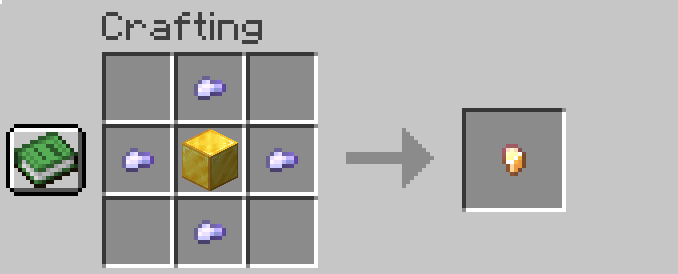
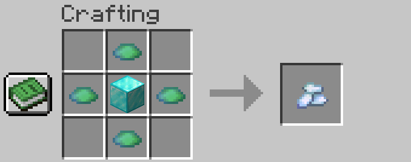

# Survival economy server

### Warpy

- Příkazem ```/warp``` zobrazíš všechny warpy na serveru.  
- - Těžit a branch minovat bez omezení můžeš na ```/mine``` warpu. Stavět bez omezení můžeš na ```/priroda```.  
- - Prosíme o dodržování těchto pravidel, abychom měli stavební mapu stále krásnou a ne jak krtčí noru.  

### Vydělávání peněz

- Peníze si můžeš vydělat pomocí Jobs. Stačí se podívat, která práce by tě bavíla příkazem ```/jobs browse```.
- A kde můžeš peníze utratit? Jdi na ```/warp trade```

### TOP

- Peníze  ```/baltop```
- McMMO  ```/mctop```

### Aukce a prodej itemů přes /ah
- Můžeš mít 3 itemy na prodej a 3 v aukci
- Otevření aukcí **/ah**
- Prodej **/ah sell [cena]** (item musíš držet v ruce)

### Arény a PVP
- Chceš si zahrát sám nebo s kamarády MobArénu? Zajdi na  ```/ma j```.
- Nebo si troufáš na PVP? Tak jdi na ```/xp```

### Stavba

- Stavět můžeš kdekoliv na mapě, kde není již stávající region.  
- Region chápej jako pozemek, který už někdo vlastní.  
- Do mapy, kde je možné stavět, se dostaneš přes ```/priroda```.

## Ochrana pozemku

- Začneme ochranou pozemku - na ```/warp priroda``` sis našel/a krásné místo.   
- Zda tam není jiný region, stačí napsat ```/rg info``` - to ti vždy vypíše informace o regionu a tak zjistíš, zda tam opravdu je či není.
- - Fun fact: ```__global__``` region není region pro hráče, ale takový region, který je všude (ber to jako default, ty si děláš vlastní nad ním).

### Pojďme si ochránit pozemek

- Máš pozemek, nikdo tam na něm není? Super! Tak vytas označovátko příkazem ```//wand```.
- Nyní potřebuješ označit dva body. Ber, že máš pozemek 50x50, takže musíš začít máchnutím na první blok, který je v levém "spodním" rohu a druhý, úhlopříčný v pravém "horním" rohu.

Zde je v nákresu označen levý roh A a pravý jako B. 
```
+------------------B
|                  |
|                  |
|                  |
|                  |
|                  |
A------------------+
```

- Máš označeno? Skvělé. Nyní potřebuješ napsat ```//expand vert```, aby si měl ochranu pozemku 50x50 a hlavně od bedrocku až po nebe.
- Hráč může mít 4 regiony, které jsou 50x50 velké (a s ```//expand vert``` jsou chráněné na komplet výšku). Komplet výška je důležitá proto, aby se ti nikdo nemohl dostat nad pozemek a polít tě lávou.
 - **Máme opravdu označeno s expandem?** Skvělé! Tak pojďme vytvořit samotný region. Stačí ti příkaz  ```/rg claim NÁZEV_REGIONU```, tedy například  ```/rg claim ostrava```, pokud chceš, aby se tvůj region jmenoval Ostrava.

#### Smazání regionu
- Příkazem ```/rg remove názevregionu```

### Máš kamarády a chceš s nimi stavět
- Získal si kamarády, skvělá práce! Tak je pojďme pozvat do tvého pozemku.

1. Zjisti si název pozemku (musíš v něm stát) ```/rg info```
2. Region se jmenuje např. ostrava a hráč se jmenuje johndeer
3. Hráče přidáš příkazem ```/rg addmember ostrava johndeer``` a odebereš příkazem ```/rg delmember ostrava johndeer```
3. Pokud hráči hodně věříš (což nedoporučujeme), tak ho můžeš přidat i jako vlastníka tvého pozemku příkazem ```/rg addowner ostrava johndeer``` a odebereš příkazem ```/rg delowner ostrava johndeer```

### Počet regionů a rozměry

- Maximální rozměr jednoho regionu je 50x50 bloků.
- Maximální počet regionů jsou 4.
- Větší regiony nebo větší počet ti rádi udělají členové AT (ale musíš mít buď dobrý důvod - např. skvělý projekt nebo jsi už všechno zastavěl).
- VIP mají vyšší počet regionů než 4.

## Klíče a jak je získat

- Základní klíč získáš pomocí hlasování na https://minecore.cz/hlasovani

**Zlatý klíč**

- 4x Železný klíč
- 1x Gold block



**Smaragdový klíč**

- 4x Zlatý klíč
- 1x Emerald block


**Diamantový klíč**

- 4x Smaragdový klíč
- 1x Diamond block



**Obsidiánový klíč**

- 8x Diamantový klíč
- 1x Netherite block


## Chytání mobů do vajíček

Potřebuješ magické vejce, které získáš takto:  

**Magic Egg**

- 1x  Egg
- 1x Honey Bottle
- 1x Fermented Spider Eye
- 1x Glow Berries
- 1x Torchflower Seeds
- 1x Pitcher Pod
- 1x Chorus Fruit


## Enchanty

### Armor Enchantments
Name | Description | Applies To | Conflicts With
-- | -- | -- | --
Aquaman | Grants Water Breathing effect. | Helmet | -
Bunny Hop | Grants Jump Boost effect. | Boots | -
Cold Steel | Applies Mining Fatigue effect to the attacker. | Chestplate | -
Darkness Cloak | Applies Darkness effect to the attacker. | Chestplate | -
Elemental Protection | Reduces Poison, Magic, Wither, Lightning, Freeze damage. | All Armor | -
Flame Walker | Similar to the vanilla Frost Walker enchantment,  creates magma blocks when walking over lava, and causes the wearer to be  immune to damage from magma blocks when stepped on. | Boots | Frost Walker
Fire Shield | Like Thorns, but ignites the attacker. | Chestplate  | -
Ice Shield | Freezes and slows down the attacker. | Chestplate | -
Hardened | Grants Damage Resistance effect on receiving damage. | Chestplate | -
Night Vision | Grants Night Vision effect. | Helmet | -
Regrowth | Restores certain amount hearts over the time regardless of the food and saturation levels. | Chestplate | -
Saturation | Restores certain amount of food and saturation over the time. | Helmet | -
Self-Destruction | Creates an explosion on death. | Chestplate | -
Sonic | Grants Speed effect. | Boots | -
Stopping Force | Reduces knockback when getting damage. | Leggings | -

### Bow Enchantments
Name | Description | Applies To | Conflicts With
-- | -- | -- | --
Bomber | Chance to launch TNT instead of an Arrow. | Bows, Crossbows | Power, Punch, Flame, Flare, Ender Bow, Ghast, (Arrow Effect Enchants)
Ender Bow | Chance to launch an Ender Pearl instead of an Arrow. | Bows, Crossbows | Ghast, Bomber, Flare
Ghast | Chance to launch a Fireball instead of an Arrow. | Bows, Crossbows | Ender Bow, Bomber, Flare
Flare | Chance to create a torch where arrow land. | Bows, Crossbows | -
Sniper | Increases projectile speed. | Bows, Crossbows | -
Hover | Chance to launch an arrow with Levitation effect on hit. | Bows, Crossbows | Ender Bow, Ghast, Bomber
Confusing Arrows | Chance to launch an arrow with Nausea effect on hit. | Bows, Crossbows | Ender Bow, Ghast, Bomber
Dragonfire Arrows | Chance to launch an arrow with Dragon Breath effect on hit. | Bows, Crossbows | Ender Bow, Ghast, Bomber
Darkness Arrows | Chance to launch an arrow with Darkness effect on hit. | Bows, Crossbows | Ender Bow, Ghast, Bomber
Electrified Arrows | Chance to launch an arrow with Lightning effect on hit. | Bows, Crossbows | Ender Bow, Ghast, Bomber
Explosive Arrows | Chance to launch an arrow with Explosion effect on hit. | Bows, Crossbows | Ender Bow, Ghast, Bomber
Poisoned Arrows | Chance to launch an arrow with Poison effect on hit. | Bows, Crossbows | Ender Bow, Ghast, Bomber
Vampiric Arrows | Chance to restore health on arrow hit. | Bows, Crossbows | Ender Bow, Ghast, Bomber
Withered Arrows | Chance to launch an arrow with Wither effect on hit. | Bows, Crossbows | Ender Bow, Ghast, Bomber

### Tool Enchantments
Name | Description | Applies To | Conflicts With
-- | -- | -- | --
Blast Mining | Chance to create an explosion that mines all blocks in it's area. | Pickaxes | Tunnel, Veinminer
Divine Touch | Chance to mine a Spawner with it's Entity Type. | Pickaxes | Smelter
Haste | Chance to receive Haste effect on block break. | Tools | -
Lucky Miner | Chance to receive more exp from mined blocks. | Pickaxes | -
Replanter | Automatically replant crops on harvest or right-click. | Hoes | -
Silk Chest | Chance to save all chest's content in the dropped item on break. | Axes | -
Smelter | Chance to smelt dropped items into other materials. | Tools | Silk Touch, Divine Touch
Telekinesis | Chance to move all block loot directly to your inventory. | Tools | -
Treasures | Chance to receive additional loot from certain blocks. | Pickaxes, Axes, Shovels | -
Tunnel | Chance to mine 1x2 area on level I, 2x2 on level II, 3x3 on level III. | Pickaxes, Shovels | Veinminer, Blast Mining
Veinminer | Chance to mine the whole ore vein at once. | Pickaxes | Tunnel, Blast Mining

### Fishing Enchantments
Name | Description | Applies To | Conflicts With
-- | -- | -- | --
Auto Reel | Automatically reels in a hook on bite. | Fishing Rod | -
Double Catch | Increases amount of caught item by x2. | Fishing Rod | -
Seasoned Angler | Increases amount of gained XP from fishing. | Fishing Rod | -
Survivalist | Automatically cooks fish if what is caught is raw. | Fishing Rod | -
River Master | Increases casting distance. | Fishing Rod | -
Curse of Drowned | Chance to fish up a Drowned Zombie. | Fishing Rod | -

### Weapon Enchantments
Name | Description | Applies To | Conflicts With
-- | -- | -- | --
Bane of Netherspawn | Chance to inflict additional damage to nether mobs. | Swords, Axes | Sharpness, Bane of Arthropods, Smite, Village Defender
Blindness | Chance to apply Blindness effect on hit. | Swords, Axes | -
Confusion | Chance to apply Nausea effect on hit. | Swords, Axes | -
Cure | Chance to cure Zombified Piglins and Zombie Villagers on hit. | Swords, Axes | -
Curse of Death | If you kill a player, you have a chance of dying too. | Swords, Axes | -
Cutter | Chance to reduce durability and unequip enemy's armor on hit. | Swords, Axes | -
Decapitator | Chance to drop enemy's head on kill. | Swords, Axes | -
Double Strike | Chance to inflict double damage. | Swords, Axes | -
Exhaust | Chance to apply Hunger effect on hit. | Swords, Axes | -
Exp Hunter | Chance to receive more exp from mobs on kill. | Swords, Axes | -
Ice Aspect | Chance to apply Slowness effect on hit. | Swords, Axes | -
Infernus | Chance to launch a flaming Trident. | Tridents | -
Nimble | Chance to move all mob loot directly to your inventory on kill. | Swords, Axes | -
Paralyze | Chance to apply Mining Fatigue effect on hit. | Swords, Axes | -
Rage | Chance to receive Strength effect on hit. | Swords, Axes | -
Rocket | Chance to launch an enemy into the space on hit. | Swords, Axes | -
Scavenger | Chance to receive additional loot from mobs on kill. | Swords, Axes | -
Surprise | Chance to apply Random effect on hit. | Swords, Axes | -
Swiper | Chance to steal player's XP on hit. | Swords, Axes | -
Temper | Chance to inflict more damage depends on how many hearts you lost. | Swords, Axes | -
Thrifty | Chance to receive mob Spawn Egg on kill. | Swords, Axes | -
Thunder | Chance to summon Lightning strike on hit. | Swords, Axes | -
Vampire | Chance to regain health on hit. | Swords, Axes | -
Venom | Chance to apply Poison effect on hit. | Swords, Axes | -
Village Defender | Chance to inflict more damage to Pillagers. | Swords, Axes | Sharpness, Smite, Bane of Arthropods, Bane of Netherspawn
Wither | Chance to apply Wither effect on hit. | Swords, Axes | -

### Universal Enchantments
Name | Description | Applies To | Conflicts With
-- | -- | -- | --
Restore | When an item breaks it loses the enchant and the item is brought back to certain durability. | All Items | -
Soulbound | Prevents item from being dropped upon death. | All Items | Curse of Vanishing
Curse of Breaking | Chance to take extra item durability points. | All Items | Unbreaking
Curse of Mediocrity | Chance to disenchant dropped items from blocks and mobs / players. | Tools, Weapons | -
Curse of Misfortune | Chance to have no drop/loot from mobs/blocks. | Tools, Weapons | Fortune, Looting
Curse of Fragility | Prevents item from being grindstoned or anviled. | All Items | -

## Lihovarnictví, fermentace a nápoje

| Recept       | Ingredience                | Čas vaření v kauldronu | Destilace | Doba zrání | Alc | Efekty |
|-------------|-------------|-----|-----|-----|-----|---|
| Beer         | 6 Wheat                    | 8 Minutes       | No  | 3 Years<br>Any         | I    |    |
| Wheatbeer    | 3 Wheat                    | 8 Minutes       | No  | 2 Years<br>Birch       | I    |    |
| Darkbeer     | 6 Wheat                    | 8 Minutes       | No  | 3 times Beer<br>Dark Oak | I'   |    |
| Red Wine     | 5 Sweet Berries            | 5 Minutes       | No  | Very Long<br>Any       | I'   |    |
| Mead         | 6 Sugar Cane               | 3 Minutes       | No  | 4 Years<br>Oak         | I'   |    |
| Apple Mead   | 6 Sugar Cane<br>Apple      | Similar to Mead | No  | 4 Years<br>Oak         | II   | +  |
| Apple Cider  | Lots of Apple              | 7/8 Minutes     | No  | 3 Years<br>Any         | I'   |    |
| Apple Liquor | Lots of Apple              | Long            | Yes | 6 Years<br>Acacia      | II'  |    |
| Whiskey      | Wheat                      | 1 min. per Wheat | Yes | Very Long<br>darker   | III' |    |
| Rum          | Lots of Sugar Cane         | Short           | Yes | Long<br>Oak            | IIII | +  |
| Vodka        | A Sixth of a Stack Potatoes | Long           | Yes | No                     | III  | -  |
| Mushroom Vodka | Potatoes, Mushrooms      | Very Long       | Yes | No                     | II' | +- |
| Gin          | 9 Wheat<br>Some blue -flowers<br>Apple | Short | Yes | No                    | III  |    |
| Tequila      | Some Cactus                | Long            | Yes | Long<br>Birch          | III  |    |
| Absinthe     | Lots of Grass              | Short           | Yes | No                   | IIIII' | -  |
| Green Absinthe | Lots of Grass<br>Another Greenish thing | Normal | Yes | No             | IIIIII | +- |
| Potato Soup  | 5 Potatoes<br>Some Grass   | Short           | No  | No                     |      | +  |
| Coffee       | Lots of Cocoa Beans<br>2 Milk Buckets | Short | No | No                     |      | ++ |
| Eggnog      | 5 Eggs<br>A little sugar<br>1 Milk Bucket | Short | No | Short<br>Any          | I'   |    |

### Pojďme si uvařit nápoj!

#### Fermentace

Nejdříve potřebuješ všechny skvělé a čerstvé ingredience

1. Dej Cauldron nad oheň
2. Naplň ho vodou
3. Přidej ingredience
4. Počkej určitý čas dle návodu
5. Naplň lahvičky s tímto úžasným lektvarem


protip: použij hodiny, aby si viděl, jak dlouho se to vaří

### Destilace
Je vhodná pouze pro určité druhy receptů.
1. Vlož lahvičku do brewing standu
2. Dej glowstone jako filtr nahoru (můžeš ho použít opakovaně).


### Zrání

Pro zrání potřebuješ barel. Ulož do barelu svůj produkt a nech zrát dle instrukcí.


